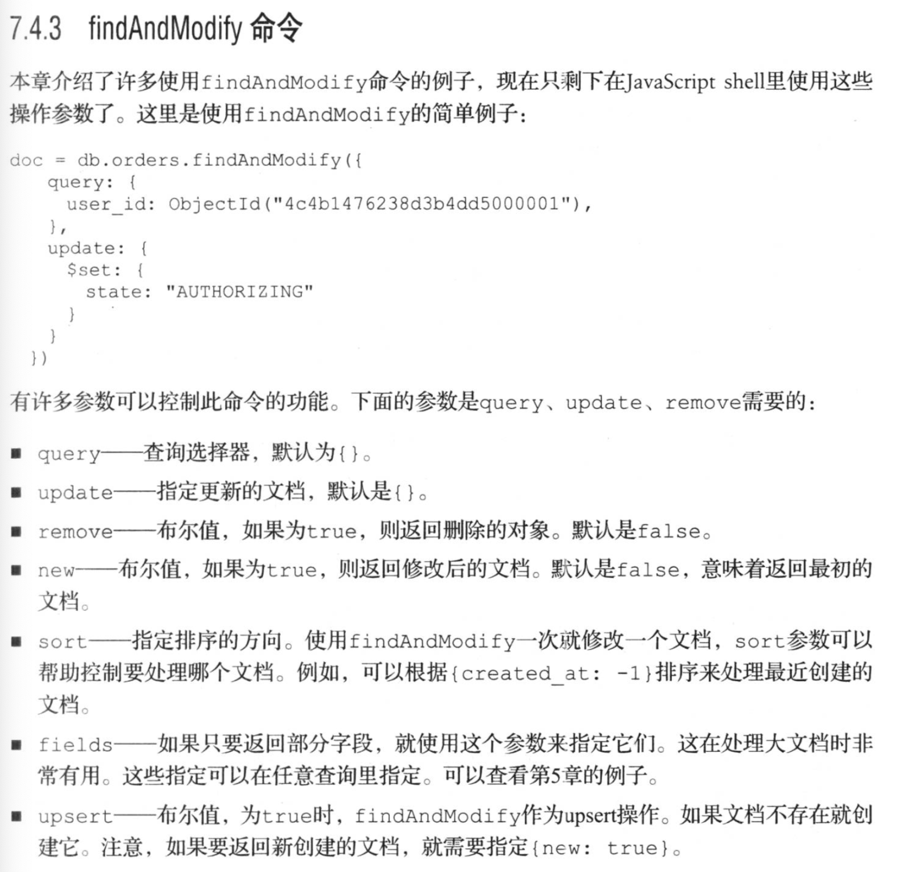

# 第一章 全新的web数据库

其数据模型和持久化策略就是为了构建高读写/吞吐量和高自动灾备伸缩性的系统

文档格式是基于json

以二进制json格式存储文档数据，或叫做bson

mongo在集合的文档里保存数据

**ad hoc 查询**
是指不需要事先定义系统接受何种查询


**可复制集合**

可复制集合在多个机器上分布式存储数据，在服务器或者网络出错时，实现数据冗余存储和自动灾备，

类似于主从复制，主节点可以同时接受读写操作，从服务器只能进行读操作


MongoDB确保写入操作在返回用户之前已经写进了RAM，日志功能默认时启用的


**水平伸缩**

通过基于范围的分区机制来实现水平扩展，成为分片机制，可以自动化管理每个分布式节点存储数据。


**命令行工具**

mongodump：把数据库数据保存为原生的BSON格式，热备份

mongorestore：恢复数据

mongoexport、mongoimport：导入或导出json、csv、tsv格式的数据

mongosniff：一个用于查看发送给数据库命令的嗅探工具。通常会把BSON转换为人类可读的shell语句

mongostat：与iostat类似，轮询MongoDB提供有帮助的状态信息，以及服务器连接数量

mongotop：与top类似，轮询显示每个集合里花费的读取和写入数据的时间总数

mongoperf：实例磁盘操作的情况

mongooplog：展示操作日志里的信息

Bsonddump：把BSON文件转换为人类可读的格式，包括json


被用来设计组合键值对存储和关系数据库的最佳特性。

键值对存储快，容易伸缩


MongoDB通常用于64位系统，32位系统只能寻址4GB内存


使用虚拟内存映射的第二个结果是数据内存会根据需要自动分配。

当查询数据大于内存大小的数据集，通常需要访问磁盘来获取额外的数据。查询速度开始变慢


面向文档的数据库管理系统，为全新的互联网应用的数据模型和伸缩性而设计，具有动态查询和辅助索引、快速原子更新以及复杂聚合，支持自动化灾备的复制，还有水平伸缩的分片集群等特性


# 第二章  通过JavaScript shell 操作MongoDB


Mongo 把数据存储在文档中，称之为集合，与mysql中的表类似


为什么MongoDB有数据库和集合？

取决于MongoDB如何在磁盘上写数据。

数据库中索引的集合都分组在相同的文件中，所有从内存的角度说，是合理的，保证相关的结合在同一个库里。


数据库的创建不是必须的，只有在第一次插入数据库和集合时才会创建。


**插入**

```
db.user.insert({username:"smith"}) //插入
db.users.find() // 查询
db.users.find({username:"jones"}) //查找数据 多个条件 是and
db.users.count()
```


_id字段默认添加到文档里，可以做为文档的主键。


**更新**

```
> db.users.update({username:"smith"},{$set:{country:"Canada"}})
WriteResult({ "nMatched" : 1, "nUpserted" : 0, "nModified" : 1 }) 
```


**替换更新**

```
db.users.update({username:"smith"},{country:"canada"})
WriteResult({ "nMatched" : 1, "nUpserted" : 0, "nModified" : 1 })
 // { "_id" : ObjectId("5e09c6d220e0f21b11911be1"), "country" : "canada" }

```

​	文档被替换为只包含 country字段的文档，username字段被删除，

第二个参数用来更新替换。


**删除一个属性**

```
{ "_id" : ObjectId("5e09c75220e0f21b11911be2"), "username" : "jones", "country" : "Canada" }

> db.users.update({username:"jones"},{$unset:{country:"Canada"}})
WriteResult({ "nMatched" : 1, "nUpserted" : 0, "nModified" : 1 })

> db.users.find()
{ "_id" : ObjectId("5e09c6d220e0f21b11911be1"), "country" : "canada" }
{ "_id" : ObjectId("5e09c75220e0f21b11911be2"), "username" : "jones" }
```


**高级更新**

```
往数组中添加数据
$push 
$addToSet ：数据存在就不会添加，保证唯一性
```


**删除数据**

```
db.foo.remove()
db.foo.remove({username:"jones"})
```


remove() 操作不回删除集合，只会删除集合中的某个文档


```
db.users.drop() 	//删除集合及其附带的索引数据
```


## 使用索引创建和查询

explain 方法键控查询


```
> for(i=0;i<20000;i++){
... db.numbers.save({num:i});}
WriteResult({ "nInserted" : 1 })
> db.numbers.count()
20000
```


```
> db.numbers.find()
{ "_id" : ObjectId("5e09cd3820e0f21b11911be3"), "num" : 0 }
{ "_id" : ObjectId("5e09cd3820e0f21b11911be4"), "num" : 1 }
{ "_id" : ObjectId("5e09cd3820e0f21b11911be5"), "num" : 2 }
{ "_id" : ObjectId("5e09cd3820e0f21b11911be6"), "num" : 3 }
{ "_id" : ObjectId("5e09cd3820e0f21b11911be7"), "num" : 4 }
{ "_id" : ObjectId("5e09cd3820e0f21b11911be8"), "num" : 5 }
{ "_id" : ObjectId("5e09cd3820e0f21b11911be9"), "num" : 6 }
{ "_id" : ObjectId("5e09cd3820e0f21b11911bea"), "num" : 7 }
{ "_id" : ObjectId("5e09cd3820e0f21b11911beb"), "num" : 8 }
{ "_id" : ObjectId("5e09cd3820e0f21b11911bec"), "num" : 9 }
{ "_id" : ObjectId("5e09cd3820e0f21b11911bed"), "num" : 10 }
{ "_id" : ObjectId("5e09cd3820e0f21b11911bee"), "num" : 11 }
{ "_id" : ObjectId("5e09cd3820e0f21b11911bef"), "num" : 12 }
{ "_id" : ObjectId("5e09cd3820e0f21b11911bf0"), "num" : 13 }
{ "_id" : ObjectId("5e09cd3820e0f21b11911bf1"), "num" : 14 }
{ "_id" : ObjectId("5e09cd3820e0f21b11911bf2"), "num" : 15 }
{ "_id" : ObjectId("5e09cd3820e0f21b11911bf3"), "num" : 16 }
{ "_id" : ObjectId("5e09cd3820e0f21b11911bf4"), "num" : 17 }
{ "_id" : ObjectId("5e09cd3820e0f21b11911bf5"), "num" : 18 }
{ "_id" : ObjectId("5e09cd3820e0f21b11911bf6"), "num" : 19 }
Type "it" for more
> it
{ "_id" : ObjectId("5e09cd3820e0f21b11911bf7"), "num" : 20 }
```


**范围查询**


```
$gt 大于   $lt 小于  运算符来进行范围查询
> db.numbers.find({num:{"$lt":3}})
{ "_id" : ObjectId("5e09cd3820e0f21b11911be3"), "num" : 0 }
{ "_id" : ObjectId("5e09cd3820e0f21b11911be4"), "num" : 1 }
{ "_id" : ObjectId("5e09cd3820e0f21b11911be5"), "num" : 2 }

> db.numbers.find({num:{"$lt":9,"$gt":5}})
{ "_id" : ObjectId("5e09cd3820e0f21b11911be9"), "num" : 6 }
{ "_id" : ObjectId("5e09cd3820e0f21b11911bea"), "num" : 7 }
{ "_id" : ObjectId("5e09cd3820e0f21b11911beb"), "num" : 8 }
```


**索引和explain**

查询引擎会扫描整个集合


```
db.numbers.createIndes({num:1}) //创建索引
```


```
db.numbers.getIndexs()
```

索引并非没有成本，他们会占用空间，而且会让插入成本稍微提升


```
db.numbers.find({num:{"$gt":123}}).explain("executionStats")// 查看查询执行的详情
```


## 基本管理

```
show dbs
show collections

```


system.indexes , 是每个数据库都存在的特殊集合，

每个入口都定义了一个数据库索引，

可以使用getIndexes（）方法来查看


```
db.stats()
```


runCommand方法实现了命令执行

```
> db.runCommand
function(obj, extra, queryOptions) {
    "use strict";

    // Support users who call this function with a string commandName, e.g.
    // db.runCommand("commandName", {arg1: "value", arg2: "value"}).
    var mergedObj = this._mergeCommandOptions(obj, extra);

    // if options were passed (i.e. because they were overridden on a collection), use them.
    // Otherwise use getQueryOptions.
    var options = (typeof (queryOptions) !== "undefined") ? queryOptions : this.getQueryOptions();

    try {
        return this._runCommandImpl(this._name, mergedObj, options);
    } catch (ex) {
        // When runCommand flowed through query, a connection error resulted in the message
        // "error doing query: failed". Even though this message is arguably incorrect
        // for a command failing due to a connection failure, we preserve it for backwards
        // compatibility. See SERVER-18334 for details.
        if (ex.message.indexOf("network error") >= 0) {
            throw new Error("error doing query: failed: " + ex.message);
        }
        throw ex;
    }
}
> 

 $cmd 集合上的查询，恰当的定义为数据库命令就是特殊集合上的查询，$cmd，查询选择器定义了命令本身
 
```


#  第四章 面向文档的数据库

| SQL术语/概念 | MongoDB术语/概念 | 解释/说明                           |
| :----------- | :--------------- | :---------------------------------- |
| database     | database         | 数据库                              |
| table        | collection       | 数据库表/集合                       |
| row          | document         | 数据记录行/文档                     |
| column       | field            | 数据字段/域                         |
| index        | index            | 索引                                |
| table joins  |                  | 表连接,MongoDB不支持                |
| primary key  | primary key      | 主键,MongoDB自动将_id字段设置为主键 |


mongo 里，数据的基本单位是BSON文档

不支持join 连接查询

_id 字段存储的值作为主键


用slug创建唯一索引，则插入重复值会抛出异常


数据库是集合和索引的命名空间和物理分组，

会在第一次写入数据的时候创建数据库


```
/data/db $ ls -la
total 1736
drwxr-xr-x  27 root  wheel     864 Dec 31 16:36 .
drwxr-xr-x   3 root  wheel      96 Dec 29 22:52 ..
-rw-------   1 root  wheel      47 Dec 29 22:53 WiredTiger
-rw-------   1 root  wheel      21 Dec 30 08:25 WiredTiger.lock // 
-rw-------   1 root  wheel    1189 Dec 31 16:36 WiredTiger.turtle
-rw-------   1 root  wheel   53248 Dec 31 16:36 WiredTiger.wt
-rw-------   1 root  wheel    4096 Dec 31 16:36 WiredTigerLAS.wt
-rw-------   1 root  wheel   36864 Dec 31 16:36 _mdb_catalog.wt
-rw-------   1 root  wheel    4096 Dec 31 16:36 collection-0--4525816760951406100.wt
-rw-------   1 root  wheel   20480 Dec 31 16:36 collection-0--7142879009499051005.wt
-rw-------   1 root  wheel   36864 Dec 30 20:30 collection-0--7168161380585458235.wt
-rw-------   1 root  wheel   36864 Dec 31 16:36 collection-2--7142879009499051005.wt
-rw-------   1 root  wheel  262144 Dec 30 20:30 collection-2--7168161380585458235.wt
-rw-------   1 root  wheel   24576 Dec 31 16:36 collection-4--7142879009499051005.wt
drwx------   7 root  wheel     224 Dec 31 16:36 diagnostic.data
-rw-------   1 root  wheel   36864 Dec 31 16:36 index-0--411110215482716617.wt
-rw-------   1 root  wheel   24576 Dec 31 16:36 index-1--411110215482716617.wt
-rw-------   1 root  wheel    4096 Dec 31 16:36 index-1--4525816760951406100.wt
-rw-------   1 root  wheel   36864 Dec 30 20:30 index-1--7168161380585458235.wt
-rw-------   1 root  wheel   12288 Dec 31 16:36 index-2--411110215482716617.wt
-rw-------   1 root  wheel    8192 Dec 31 16:36 index-2--4525816760951406100.wt
-rw-------   1 root  wheel   20480 Dec 31 16:36 index-3--411110215482716617.wt
-rw-------   1 root  wheel  196608 Dec 30 20:30 index-3--7168161380585458235.wt
drwx------   5 root  wheel     160 Dec 31 12:29 journal
-rw-------   1 root  wheel       0 Dec 31 16:36 mongod.lock  # 存储服务器进程ID
-rw-------   1 root  wheel   36864 Dec 31 16:36 sizeStorer.wt
-rw-------   1 root  wheel     114 Dec 29 22:53 storage.bson
```


## 集合

集合是结构或概念上相似的文档的容器，

创建集合是隐式的，只有插入文档时才会创建

集合名字是通过其命名空间名字来区分的


**盖子集合**

capped collection 有上限的集合

最初是为高性能日志场景设计的，超过上限，后续的插入将会覆盖最先插入的文档数据


**TTL集合**

time-to-live ，特定的时间后废弃文档数据


**系统集合**

db.system.namespaces

db.system.indexes


## 文档

所有的文档在发给MongoDB之前都序列化为BSON格式，以后再从BSON反序列化


有效的key名字由最大255B长度的字符串组成，不能由$开头、不能包含圆点、不能包含null，负责不能序列化


所有的字符串必须使用UTF-8


数字类型：double、int、long，任意8B长度的有符号整数


时间：BSON的实际类型用来存储临时值，使用64b整数的毫秒值表示


虚拟类型


BSON 文档大小限制为16MB

1、组织开发者创建无意义的数据模型

2、16MB的限制与性能相关，在服务器段，查询大的文档时需要在发送给客户端之前把文档拷贝到缓存里，


文档的嵌套深度最大值限制是100，嵌套就是文档里包含新的文档


如果要序列化一个树形结构到Mongo文档中，其结果就是查询和访问非常困难，可能会导致其他问题，递归访问时，可能会导致堆栈溢出。


# 第五章 构建查询


```
findOne 返回一个文件
find 返回一个光标对象

db.reviews.find({'product_id':priduct['_id']}).skip(0).limit(12)
```


```
$in  	如果任意参数在引用集合里，则匹配
$all	如果所有参数在引用集合里且被使用在包含数组的文档中，则匹配
$nin	如果没有参数在引用的集合里，则匹配

```


$ne 并不等同于运算符，最佳使用方式是结合一个其他运算符，否则，会因为不是使用索引而造成效率低下。适用于关键字指向的单一值或者数组

```
$ne	不匹配参数条件
$not	不匹配结果
$or	有一个匹配就成立
$nor	所有条件都不匹配
$and	所有条件都匹配
$exists	判断元素是否存在

```


查询匹配一个实体对象，将执行严格的逐个字节比较，关键字的顺序非常重要


```
数组操作符
$elemMatch	如果提供的所有词语在相同的字文档中，则匹配
$size				如果子文档数组大小提供的文本值相同，则匹配
db.users.find({'addresses':{$size:3}})  # 查询拥有三个地址的所有用户

```


```
正则表达式
$regex
$mod[(quotient),(result)]		如果元素除以除数符合结果则匹配
$type		如果元素的类型符合指定的BSON类型则匹配
$text		允许在建立文本索引的字段上执行文本搜索
```


**查询选择**


```
映射
$slice 选择返回文档的子集
{$slice:[11,22]} # 跳过前11条评论，并限制评论为12条


```

**跳过和限制**

skip、limit

当skip大于10000，则这种查询服务器要求扫描的文档书等于skip值，效率非常低，更好的策略是完全忽略skip并且将范围添加到查询，指示下一个结果设置的位置。


# 第六章 聚合


为调用聚合框架就要定义一个管道。

聚合管道里的每一步输出都作为下一步的输入，每一步都在输入文档上执行单个操作并生成输出文档


**聚合管道操作包括**

$project：指定输出文档里的字段

$match：选择要处理的文档，与find类似

$limit：限制传递给下一步的文档数量

$skip：跳过一定数量的文档

$unwind：扩展数组，为每个数组入口生成一个输出文档

$group：根据key来分组文档

$sort：排序文档

$geoNear：选择某个地理位置附近的文档

$out：把管道的结果写入某个集合，创建一个集合，不会修改之前的集合

$redact：控制特定数据的访问

```
db.products.aggregate([{$match:...},{$group:...},{$sort:...}])
```


聚合管道可以返回光标，但是当使用光标执行这种伪连接的时候要注意消耗的时间


# 第七章 更新、原子操作和删除

更新操作会取代整个文档，多个用户更新同一个文档，则只会保存最后更新的数据

目标更新通常使用更新操作符，操作符通常使用动词构造（set、push等）


更新操作符使用前缀表示符，而查询操作使用中缀表示符


目标更新呢通常可以获得更好的性能，因为，不需要往返服务器来获取并修改文档数据

```
目标操作允许原子更新文档，使用乐观锁来实现原子更新。使用目标更新，可以使用 $inc来原子性修改计数器。意味着，即使大并发更新，每个$inc都会隔离操作，要么成功，要么失败

输入位置定位符 $ , 使用自己来替代匹配选择器数组元素的索引，启用更新。

upsert 会创建由查询器定位的文档，因此初始化的upsert将会生成一个文档
```


## 原子文档处理

findAndModify

这个命令允许我们在同一个往返过程中原子更新文档并返回它，

原子更新就是一个不会被其他更新中断或者与其他操作交互的操作。

其他所有操作必须等待原子更新完成才行

可以用来构建工作对列和状态机，然后使用这些原始语句来构建事务语以


```
$inc
可以增加或者减少一个数值
也可以添加或减去任意的数值
因为它很少用于修改文档的大小，通常发生在磁盘上，因此只影响指定的值
```

```
$set 
设置某个文档里的特定key值
可以为key设置任意有效的BSON类型值
如果key已经存在，它的值就会被重写，否则，创建新的key值

$unset 
会从文档中删除提供的key
单个数组元素上使用unset 可能无法准确使用，仅仅会设置元素的值为null而不是删除元素。完全删除数组元素，可以使用pull和pop

$rename
修改key的名字，也可以修改子文档的名字

SetOnInsert
只新增数据，而不会修改数据

```


```
数组更新操作符
push、pushAll、each

push 在数组后面追加值
pushAll来添加多个值到数组上

slice 
当想数组添加值但是不想数组太大的时候使用
必须与push、each操作符一起使用
允许用来剪短数组的大小、删除旧的值
slice的参数必须是小于或者等于0，这个参数的值是数组里允许的项目数量乘以-1


sort
有时候先排序，再删除他们

addToSet
只会添加数组里面不存在的值

pop
删除最后一个元素

bit
按位运算的操作符


pull 、 pull
可以通过值精确指定要删除的元素
```


**定位更新**


$  允许我们通过原点选择器来定位要更新的元素

 


## 并发、原子性、隔离

WiredTiger存储引擎工作在集合级别，提供了更强大的文档级别的锁。


把高并发的集合保存到单独的数据库里


$isolated来保持操作独立，不会让路。


**MMAPv1存储引擎**

更新磁盘上的文档有三种方式

 1、当只更新文档里的单个值并且BSON文档大小不会改变时才发生。例如inc只增加整数，磁盘上的文件不会发生变化

2、更新是修改文档的大小和数据结构，

BSON文档表示位字节数组，前4个字节表示文档的大小。

push操作符修改文档，既增加文档的大小又修改结构，这需要在磁盘上重写整个文档。


3、更新是重写一个文档，如果文档扩大，但是不能满足现在的磁盘空间，则不仅仅需要重写，还需要移动到新的空间里，


# 第八章 索引与查询优化

**复合索引**

多个键值的索引叫做复合索引


**索引规则**

1、索引可以大大减少要处理的文档数量。没有适当的索引，唯一满足条件的查询方式就是扫描全部文档，直到找到满足条件的查询

2、唯一的单键索引将会用来处理查询。对于包含多个键的查询，包含这些键的复合索引是最好的解决方案

3、如果一个复合索引a-b，那么a上的索引就是多余的，b上的不多余。

4、复合索引的键值顺序很重要。


**单键索引**

使用单键索引，每个索引入口对应文档索引里的单个值。

默认的索引在_id字段上


**索引效率**

索引对查询性能非常重要，但每个新的索引都需要额外的维护成本。

集合里添加新的文档，每个集合的索引就必须修改以包含新的文档。


即使所有的索引都建设的恰当，也可能无法加快查询。这回在索引和数据集没有加载到RAM的时候发生。


索引单独存储在RAM里，而且无法聚集。在聚集索引里，索引的顺序与基础数据的存储顺序一一对应。


**B-树**

绝大部分的索引使用了B-树数据结构。

1、方便各种查询

2、在添加和删除键值之后都会保持平衡


## 索引类型

唯一索引


**稀疏索引**

索引默认是密集型的，对于索引集合中的每个文档，存在一个对应的入口，即使文档的索引键值缺失。

稀疏索引中，只有包含某些索引键值的文档才会出现。

创建稀疏索引需要指定 {sparse:true}


集合中大量的文档不包含所有键值时。


**多键索引**

允许在索引里使用多个入口来连接同一个文档。索引字段位数组。


**哈希索引**

mongo 也支持哈希索引，这里的入口首先通过河西函数来确定，意味着哈希值决定顺序。

```
db.recipes.creaateIndex({recipe_name:'hashed'})
索引值是最初参数的哈希值，所以这些索引也有一些限制：
1、等值查询相似，不支持范围查询。
2、不支持多键哈希
3、浮点数在哈希之前转为整数
哈希索引上的入口是均匀分布的
```


**地理空间索引**

查询某个地点附近的文档，基于经纬度来存储每个文档。


## 索引管理


**创建索引**

createIndex() 

创建一个带有新索引的文档并把它存储到专门的system.indexes集合里


deleteIndexes

删除索引


事先为用户数据创建索引，这样可以从开始确保索引处于理想状态下的平衡度和压缩度


声明索引非常简单，所以促发索引构建也非常简单。如果数据集足够大，构建过程会花费大量时间。


构建索引分两步：

第一步：对构建索引的值进行排序，排序过的值插入B-树里的效率更高

第二部：排序后的值插入索引中。进度显示方式相同


**后台索引**

生产环境下无法停止数据库访问，就可以指定在后台构建索引。


**离线索引**

后台索引可能还会对服务器造成无法接受的压力。

离线构建索引了，离线复制一个新的服务器节点，然后在此服务器上创建索引，并且允许此服务器复制主服务器数据。

一旦更新完毕，就可以把此服务器作为主服务器，然后采用第二台离线服务器构建索引。这个策略假设复制oplog日志足够大。


**碎片整理**

如果应用对于数据库执行大量更新和删除操作，可能会产生许多索引碎片。

B-树也会自己调整一些空间。索引碎片最大的问题是实际的空间远远大于数据需要的空间。

索引碎片会导致使用更多的内存空间。这时候可以考虑重建所有的索引。


## 找出慢速查询


**使用PROFILER分析器**

```
use stocks # 选择监控的数据库
db.serProfilingLevel(2)#设置分析级别

```


- 使用监控分析器的良好方式是使用粗略设置和向下工作模式启动它。
- 当启动监控分析器后，我们想要监控所有的应用程序操作，意味着测试所有应用程序的读取和写入操作
- 要彻底分析问题，这些读、写操作应该在真实的条件下执行。


使用explain命令找出原因


cursor字段告诉我们一直在使用BasicCursor，表示在扫描集合而不是索引，如果使用的是索引，值就是BTreeCursor


scanAndOrder字段具体介绍了查询缓慢的原因。这个指示器会在查询优化器无法使用索引返回排序集合时出现。


优化规则

1、避免scanAndOrder，如果查询包含排序，则藏尸使用索引排序。

2、使用有用的索引约束满足所有字段----尝试为查询选择器中的字段使用索引

3、如果查询包含范围或者排序，则选择最后一个key使用的索引来帮助处理范围和排序。


## 查询模式


**单键索引**

应用场景：

1、精确匹配

2、排序：在索引字段上排序

3、范围查询。范围查询可能在同一个字段上使用或者不使用排序。


**复合索引**

复合索引可以高效的服务单键值范围或者每个查询排序。

用于场景：

1、精确匹配

2、范围匹配

3、覆盖索引

覆盖索引不是一种索引，而是一个索引的特殊使用。特别是如果需要的数据都驻留在索引里，


# 第九章 文本搜索


# 第十章 WiredTiger与可拔插存储


存储引擎是数据库和硬件直接的接口。

存储引擎不会改变shell或驱动里执行的查询，它也不回在集群级别干扰Mongo，但是存储引擎影响如何从磁盘写入、删除、读取数据，还有存储数据使用的数据结构。

可拔插存储引擎API允许第三方为mongo开发存储引擎，

MMAPv1存储引擎基于内存映射，当有大量要存储的数据时，随着数据的增长它会快速消耗大量的磁盘空间，每次预分配2GB的增长空间。


## WiredTiger

是一个高性能、可伸缩的、开源数据库存储引擎，专注于多核伸缩性和最佳的内存使用。


Zlib：是LZ77算法的一个变种，LZ77使用的霍夫曼编码，而且是gzip压缩算法的基础。

Snappy：google开发，并非关注最大化压缩，而是关注告诉和合理的压缩比例


# 第十一章 复制

可复制集群工作原理oplog、heartbear。oplog允许复制数据，heartbeat监控状态并促发灾备。

**oplog**

oplog是个盖子集合，它存在于每个复制节点的local数据库里，而且记录了所有的数据变化。

每次客户端写入主节点数据，包含足够重生信息的项目就会添加到主节点的oplog中，

一旦写入的数据被复制到某个从节点，从节点的oplog也会存储这个吸入请求的记录。

每个oplog项目通过BSON的时间戳来区分，并且所有的从节点使用时间戳来跟踪它们应用的最新项目。


local数据库存储了所有的可复制集群中的元数据和oplog操作日志，数据库中的数据在本地节点被认为是唯一的，而且不能重复


每当重新配置可复制集，都会导致选举新的主节点，所有的客户端都会关闭。这样可以确保客户端不会写数据的从节点。


配置文档参数

- _id ：唯一的自增整数，用来表示成员ID，必须是递增的
- host：存储主机的名字和端口。
- arbiterOnly：一个布尔值，true或者false，表示这个成员是否是裁判。裁判只存储配置。它们是轻量级的成员，只参与主节点选举工作，不参与复制数据。
- priority：其数值指定此节点被选举为主节点的优先级。对于可复制集，开始和故障时都会尝试选举新的主节点，只要它的操作日志最新，就使用最高的优先级。它可以帮助简化选举最强的机器成为主节点。
- votes ：默认情况下所有的可复制集成员都有一个投票机会。可设置为允许给某个成员投多票。
- hidden：true时，用isMaster命令查询时不会出现应答消息。因为mongo驱动通过isMaster来确定可复制集的拓扑图，隐藏成员可以保持驱动访问此成员。这个设置可以buildIndexes一起使用，而且必须于slaveDelay一起使用。此成员被配置为隐藏模式
- buildIndexes：布尔值，默认时true，用来决定此成员是否构建索引。只有当此成员从来不会变成主节点时才会设置为false。此参数是专为备份节点设计的。
- slaveDelay：从节点与主节点复制数据的延迟时间。
- tags：包含键值对的集合文档，通常用来区分某个数据中心的成员或服务器机房位置。


**可复制集状态**

可以通过运行replSetGetStatus命令来查看可复制集和成员的状态。

rs.status，则结果文档将显示各个成员的状态、运行时间和日期操作次数。


干净失败：此时该节点的数据文件仍然是完整的。如果一个节点与集群中的其他节点失去连接，就只能等待连接恢复，而且分区节点会重新成为集合中的一员。但是能够重新干净地上线。一旦进程重新启动，它就可以重新加入集群中。

绝对失败：此时节点的数据文件要么丢失，要么冲突。不干净的关闭了mongod进程，而且还没有启用日志。唯一恢复手段就是通过再同步或者从最新的备份里恢复数据文件。


要完全再同步，可以在故障节点上使用空的文件夹来重新启动mongod实例。只要主机和端口没有改变，新的mongod就会重新加入可复制集，然后重新同步现有的数据。如果主机或者端口改变，那么在mongod启动后，就要必须重新配置可复制集。


要从备份恢复数据，就要复制备份的数据文件到mongod数据路径下。然后它会自动楷书再同步，而且可以通过检查日志或者运行rs.status来检验这个过程。


**部署策略**


# 第十二章 使用分片集群扩展系统

当单台机器无法处理负载压力时，可以汇聚大量低价、低处理能力的机器来解决问题。

mongo的分片sharding就是为了解决这中问题而设计的，把超大数据使用更小的片进行分区存储，这样就不需要再单个机器上存储所有的数据或者承担全部压力


**分片**

就是把大型数据集进行分区成更小的可管理的片的过程。


通常分片有两种情况

- 存储分布式
- 负载分布式


 


- 分片：存储了应用程序的数据，只用mongo路由器或者系统管理员可以直接连接分片服务器节点。每个分片可以单独作为开发和测试的阶段
- mongos路由器：缓存了集群的元数据并使用它来路由操作到正确的分片服务器。提供给客户端单点连接集群的方式，使得整个集群看起来就像单个节点一样。
- 配置服务器：一直存储集群的元数据，包括哪个分片包含哪些数据集。配置服务器保存的元数据是集群正常工作和更新维护的关键。每次mongos启动，都会从配置服务器获取一份元数据拷贝。mongos进程写入它们时，使用的是两阶段提交协议。可以确保跨配置服务器的一致性。


**在分片集群中分散数据**

四种分片级别：文档、块、集合、数据库四种粒度


文档：最小的数据单位。把买个文档及其字段作为一个原子性单元

块：根据某个字段的值集群的一组文档。块是只存在集群组里，根据一个或者一组字段的值进行逻辑分组，这些字段成为**分片键**。

集合：数据库中一组命名的文档。允许用户把数据库分组为有意义的逻辑组。这就是一组命名的文档，而且它必须被应用显示指定才能进行查询

数据库：包含文档的集合。这是系统中最顶级的命名组。因为数据库包含文档的集合，所以集合也必须制定在文档上执行的操作。

**分片集群中的数据分散方式**

数据可以分布到集群中4个分组中的2个上：

- 在整个数据库级别  这里每个数据库的所有集合都存在自己的分片上
- 分区或者集合分块级别   这里集合里的文档被分散到多个片上，根据某个或者多个字段子（分片键）进行分片

文档时最小的可能数据单位。但是事实上，不仅要分区数据，而且还要能够找到它们，


**分布式数据库分片**

在分片集群中创建数据库时，每个数据库分配到不同的片上。

如果什么都不做，此数据库和它的所有集合都会永久存储在创建的片服务器上。

将数据库分为2个，完全由开发决定表哥数据存储到哪个集合里，以及如何在后续的查询中找到正确的数据库。


**集合分片**

分片单个集合。自动分片一次的本意，因为这是mongo做出分区决定的分片形式，不需要应用参与。

为了分片单个集合，定义了块的概念，它是一个基于与定义字段值或分片键的逻辑分组文档，选择分片键是用户的职责

选出两个或几个字段作为分片键，相当于hash，然后就会根据分片键来决定文档存储到哪个块中

底层中mongo的分片是基于范围的，意味者每个块表示一个范围的键值，查看某个文档时，以确定它属于哪个块时，首先会抽取分片键的值，然后找出包含分片键所在的块。


---

参考

https://www.cnblogs.com/clsn/p/8214345.html#auto_id_0


| **成员**      | **说明**                                                     |
| ------------- | ------------------------------------------------------------ |
| **Secondary** | 正常情况下，复制集的Seconary会参与Primary选举（自身也可能会被选为Primary），并从Primary同步最新写入的数据，以保证与Primary存储相同的数据。Secondary可以提供读服务，增加Secondary节点可以提供复制集的读服务能力，同时提升复制集的可用性。另外，Mongodb支持对复制集的Secondary节点进行灵活的配置，以适应多种场景的需求。 |
| **Arbiter**   | Arbiter节点只参与投票，不能被选为Primary，并且不从Primary同步数据。比如你部署了一个2个节点的复制集，1个Primary，1个Secondary，任意节点宕机，复制集将不能提供服务了（无法选出Primary），这时可以给复制集添加一个Arbiter节点，即使有节点宕机，仍能选出Primary。Arbiter本身不存储数据，是非常轻量级的服务，当复制集成员为偶数时，最好加入一个Arbiter节点，以提升复制集可用性。 |
| **Priority0** | Priority0节点的选举优先级为0，不会被选举为Primary比如你跨机房A、B部署了一个复制集，并且想指定Primary必须在A机房，这时可以将B机房的复制集成员Priority设置为0，这样Primary就一定会是A机房的成员。（注意：如果这样部署，最好将『大多数』节点部署在A机房，否则网络分区时可能无法选出Primary） |
| **Vote0**     | Mongodb 3.0里，复制集成员最多50个，参与Primary选举投票的成员最多7个，其他成员（Vote0）的vote属性必须设置为0，即不参与投票。 |
| **Hidden**    | Hidden节点不能被选为主（Priority为0），并且对Driver不可见。因Hidden节点不会接受Driver的请求，可使用Hidden节点做一些数据备份、离线计算的任务，不会影响复制集的服务。 |
| **Delayed**   | Delayed节点必须是Hidden节点，并且其数据落后与Primary一段时间（可配置，比如1个小时）。因Delayed节点的数据比Primary落后一段时间，当错误或者无效的数据写入Primary时，可通过Delayed节点的数据来恢复到之前的时间点。 |

---

